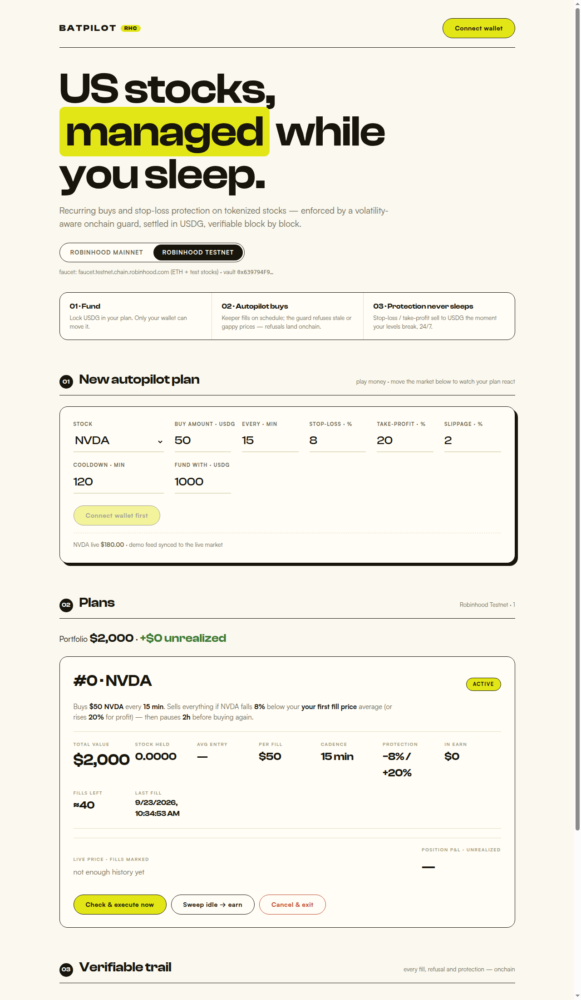
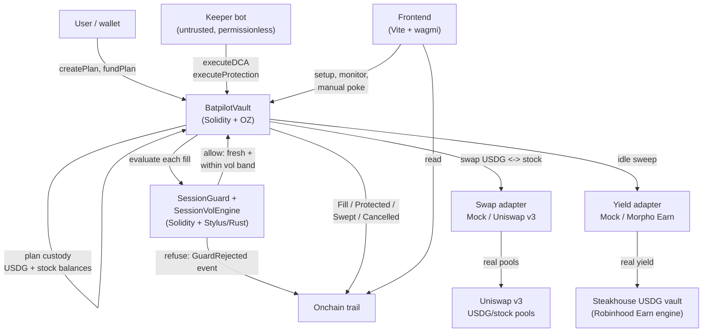

# Batpilot — your US stocks, managed while you sleep

Non-custodial autopilot for tokenized US stocks on **Robinhood Chain** (Arbitrum Orbit L2):
scheduled **recurring buys** + always-on **stop-loss / take-profit protection**,
enforced by a session-aware onchain guard, settled in **USDG**, with a verifiable
onchain trail. Built for the Arbitrum Open House Singapore Buildathon.

**Status: live on Robinhood testnet and mainnet.** See [Deployments](#deployments-live-via-quicknode).

- Testnet app: https://batpilot-testnet-kiters-projects-e9e82f9c.vercel.app
- Mainnet app: https://batpilot-mainnet-kiters-projects-e9e82f9c.vercel.app



---

## 1. Thesis

**US market hours are 21:30–04:00 in Singapore.** Millions of Asian investors hold
(or want) US equities but sleep through every session. Brokers answer with thin,
limit-only after-hours trading; onchain answers with nothing at all — no recurring
buys, no spot protection. (Only Binance's *custodial* CEX offers stock DCA; only
perps have TP/SL.)

Meanwhile tokenized stocks have a structural flaw most DeFi ignores: they **trade
24/7 but are priced 24/5**. Chainlink equity feeds follow market hours and hold
last prints on weekends. Any automation built on naive oracle reads either trades
blind into stale prices or must be switched off half the week.

**Batpilot turns that flaw into the moat.** Instead of venues, aggregators, or
another dashboard, it sells one outcome — *sleep*: set a plan once, buys execute
on schedule, downside is capped around the clock, idle cash earns yield. Underneath,
a session-aware execution firewall treats market sessions as a first-class onchain
concept: every fill is screened for freshness, price continuity, and corporate
actions, and refusals are emitted as events. **The fill it refuses is the proof
it's safe.** Nothing acts blind — ever.

Why now: Robinhood Chain mainnet (July 2026) + native USDG + per-stock Chainlink
feeds + live Uniswap pools + zero DCA/protection incumbents = a window where this
is buildable, unclaimed, and directly aligned with the program's reserved
Robinhood-Chain prizes and USDG bonus.

## 2. How it works

A user creates a plan (stock, USDG per fill, cadence, stop-loss %, take-profit %,
freshness bound, price band) and funds it. An untrusted keeper — anyone can run
it, including the user — pokes `executeDCA` / `executeProtection` when conditions
look met. **The contracts, not the caller, decide.** Idle USDG sweeps to an Earn
vault. Everything lands in USDG; every decision lands onchain with price + feed
timestamp.



**Contracts** (`contracts/src/`):

| Contract | Role |
|---|---|
| `BatpilotVault.sol` | Plans, custody, DCA + protection execution, ERC-8056 corporate-action tripwire, yield sweep, full exit |
| `SessionGuard.sol` | Reference firewall: staleness / band / pause / validity checks + batch screening |
| `SessionVolEngine.sol` | **Volatility-adaptive bands from feed round history** (testnet `0xcBdDd6bF0d98Cc38cfc4E7aA37189ef8F4bc2A71`, verified): tight mid-session, wide at the open, base-band fallback when history is thin |
| `UniswapV3Adapter.sol` | Production swaps via SwapRouter02 with oracle-anchored slippage floor |
| `MorphoEarnAdapter.sol` | Production yield via any ERC4626 Earn vault |
| `Mocks.sol` | Demo stack: mUSDG, 8056 stock tokens, controllable feeds (incl. writable round history), priced router, ~7% APR vault |

**Stylus** (`stylus-guard/`): Rust ports with identical semantics. `vol_band`
is the honest WASM workload — per-round ratios, variance accumulation, and an
iterative integer square root, branchy 256-bit math with zero storage I/O.
Deployed on RHC testnet at `0xcd587f1d57c24cff0d83c1a5f686d2d364114c55`.

Onchain benchmark, same 13-price window (testnet, `cast estimate`):

| Implementation | Gas | Output |
|---|---|---|
| Solidity `bandFor` (12 round reads + math) | 133,746 | band 335 · vol 135 · n 12 |
| Stylus `volBand` (calldata prices + math) | 78,311 | band 335 · vol 135 · n 12 |

Bit-identical outputs, **41% less gas** end-to-end on the keeper fast-path
(~24% on pure compute after subtracting the round-read CALLs). The Stylus
contract answers `volBand` (camelCase ABI) with the same reason-code constants.

**Keeper** (`keeper/`): simulate-then-send loop over all plans (viem/TS).
Permissionless by design: it can only trigger what the contracts already allow.

**Frontend** (`frontend/`): 60-second guided setup → plan cards (equity, entry,
protection, earn) → verifiable trail with tx links → one-click manual execution.

## 3. Proof, not claims

- **27 Foundry tests, all green**: 12 vault-loop tests (fills, stale/band/
  corporate-action refusals, stop + take-profit fires, stale-skip, sweep,
  cancel, equity); 8 vol-engine tests (flat/volatile/capped bands, static-guard
  refusal overturned for a measured reason, thin-history fallback, bad-round
  skipping); 4 mainnet-fork tests (real NVDA + Chainlink feed + 6-decimal USDG,
  incl. a fill at the real feed price and vol bands over real round history);
  3 venue tests (live Uniswap swaps both directions, Steakhouse Earn round-trip).
- **Stylus**: 7/7 parity tests + testnet deployment + onchain gas benchmark
  (table above) with bit-identical outputs.
- **Live E2E on testnet**: deploy → plan → fund → keeper auto-fill
  (`0x6756fd83…ec4c70e2`), equity exactly `$950 + 0.2777 NVDA`.
- Stylus parity tests (3/3) + `export-abi` + onchain-size check.
- Headless render test of the app.

## 4. Deployments (live, via QuickNode)

**Robinhood testnet (46630)** — full mock stack, keeper filling plan #0:

| Contract | Address | Verification |
|---|---|---|
| BatpilotVault | `0x9e75555936a2097Ce281De7EFb5CdCC281277BF5` | [Blockscout](https://explorer.testnet.chain.robinhood.com/address/0x9e75555936a2097Ce281De7EFb5CdCC281277BF5) |
| SessionGuard | `0x7F50e78b1763c05F944D898EeCC2081c767b2113` | Blockscout |
| SessionVolEngine | `0xcBdDd6bF0d98Cc38cfc4E7aA37189ef8F4bc2A71` | Blockscout |
| Stylus guard (`volBand` + firewall) | `0xcd587f1d57c24cff0d83c1a5f686d2d364114c55` | WASM onchain |
| MockSwapRouter / MockYieldVault / mUSDG / NVDA / TSLA / feeds | see broadcast record | Blockscout |

**Robinhood mainnet (4663)** — real venues:

| Contract | Address | Verification |
|---|---|---|
| BatpilotVault | `0xde7b9F01C566A4f8AdcF57CbFC738E5EA2b7Fa0a` | Sourcify exact-match + Etherscan V2 |
| SessionGuard | `0x6792E51FBD24f9315282BD5b6c5E713dCc779C69` | Sourcify |
| UniswapV3Adapter | `0xc6168fa5153E7AF6aFf0013D99A2B8D9670a1454` | Sourcify |
| MorphoEarnAdapter | `0x457ae4d9e8CC1bC6bf3babA9133D1fCe283a9ABE` | Sourcify |

Real dependencies: USDG `0x5fc5…d168`, NVDA/TSLA/AAPL + Chainlink feeds,
SwapRouter02 `0xCaf6…5cb2`, Steakhouse USDG vault `0xBeEf…09dd`.
The mainnet keeper is watching; operating plans need owner funding.

## 5. Go-to-market

**Wedge (now):** Asia's US-stock holders who already touch Moomoo/IBKR/Syfe and
Robinhood Wallet. Message: *"set it in 60 seconds, sleep through every US
session."* Distribution: Robinhood-Chain ecosystem channels, SG/MY FinTok and
investing communities, hackathon demo + Founder House. Activation = first fill
within minutes (accelerated demo cadence, weekly in prod). Retention = weekly
fills + compounding earn yield + protection alerts — a loop brokers can't copy
without custody.

**Expansion:** autopilot portfolios (MAG7/dividend baskets) → SGD on-ramp quotes
→ verifiable track-record cards (shareable proof outperforms referral bribes) →
advisors/family offices running client plans non-custodially → the onchain
equivalent of StashAway/Syfe, but provable.

**Money:** freemium fills + take-rate on swept yield + (later) white-label plans
for wallets/brokers. Yield-share aligns with the Global Dollar Network model
rather than fighting it.

## 6. Vision & roadmap

The end-state is **provable autonomous wealth management**: every rebalance,
protection trigger, and yield allocation verifiable onchain — no quarterly PDFs,
no "trust us." Batpilot starts with the narrowest valuable loop (scheduled buys
+ protection on single stocks) and earns the right to expand.

- [x] Core vault + guard + keeper + app (this repo)
- [x] Testnet + mainnet deployments, verified
- [ ] First funded mainnet plan + public track record
- [ ] `oraclePaused()` + staged-multiplier reads (Chainlink's recommended hardening)
- [ ] Uniswap v4 TWAMM execution for large scheduled fills
- [ ] Trailing stops, autopilot baskets, SGD quote rail
- [ ] Ownership to multisig + audit before external funds scale
- [ ] Founder House: family-office rails for onchain equities

## 7. Run it yourself

Prereqs: `forge`, `cargo` + `cargo-stylus`, `pnpm`, a QuickNode (or public) RPC,
a funded key in `contracts/.env` (see `.env.example` — never commit keys).

```bash
# contracts
cd contracts && forge install && forge build && forge test
forge test --match-contract BatpilotForkTest \
  --fork-url https://rpc.mainnet.chain.robinhood.com   # needs no key

# deploy (set -a; source .env; set +a first)
forge script script/Deploy.s.sol --rpc-url $RPC_URL \
  --private-key $PRIVATE_KEY --broadcast --slow

# keeper
cd ../keeper && pnpm install && cp .env.example .env  # fill VAULT
pnpm start

# app
cd ../frontend && pnpm install && pnpm dev
# prod builds: pnpm build --mode testnet --outDir dist-testnet
#              pnpm build --mode mainnet  --outDir dist-mainnet
```

Stylus: `cd stylus-guard && cargo test && cargo stylus check`.

## 8. Hosting (recommended)

- **Frontend → Vercel** (static Vite SPA; git-push previews judges can click).
  Two projects from this repo: `batpilot-testnet` (`frontend/.env.testnet` values
  as env vars) and `batpilot-mainnet` (`.env.mainnet` values). Build command:
  `pnpm --dir frontend build --mode testnet` (resp. `mainnet`).
- **Keeper → Fly.io** (24/7 loop; `keeper/fly.toml` + `Dockerfile`, `sin` region).
  One app per chain; secrets via `fly secrets set RPC_URL=… PRIVATE_KEY=… VAULT=…`.
- AWS is overkill at this stage — revisit for multi-region keepers / managed
  key infrastructure after traction.

## 9. Security notes

- OZ `SafeERC20` / `ReentrancyGuard` throughout; CEI ordering; keeper is
  trustless (can only call what contracts permit).
- Oracle discipline: freshness bound per plan, band vs last price, zero-price
  rejection, corporate-action auto-pause. Protection never acts on stale data.
- Adapter slippage floors anchored to Chainlink (not pool spot) against sandwiches.
- Known limits: single-owner admin (needs multisig), mock stack on testnet,
  per-plan (not portfolio) accounting, no sequencer-uptime-feed check yet —
  all tracked above. No audit yet: mainnet plans should stay owner-funded
  until review.
